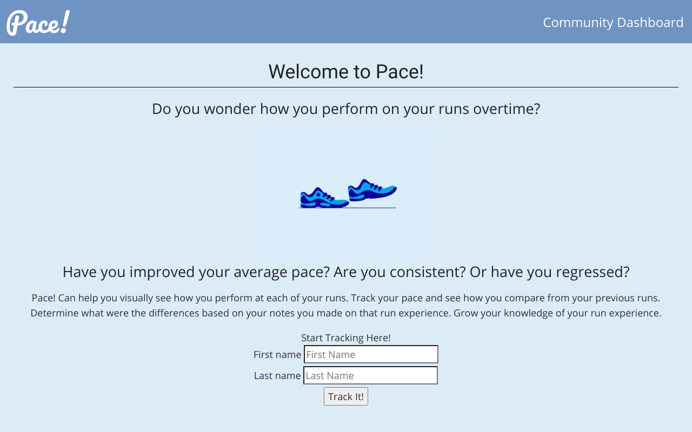

# App Name: Pace!
Live Link: https://paceclient.now.sh/

This app helps users visually see their run trends and see their progress if they are training or if they just want to see how they are performing. I don't know about you but I would like to know how I've progressed.  The user may leave notes about their experience of that particular run and provide details like their pace time.  Try it out, it's a fun one!

Designed a run tracking app using React and node.js using real life experiences and feedback of known runners. 
Tech:  React, CSS, JS, Jest

## API Documentation:

### usersRouter
| Method | HTTP request | Description |
|--------|:------------:|------------:|
| getAllUsers(get) | /api/users | Gets all the users |
| insertUser(post) | /api/users | Create a new user |
| getById(get) | /api/users/:id | Get a user by the id |

### itemsRouter
| Method | HTTP request | Description |
|--------|:------------:|------------:|
| getAllItems(get) | /api/items | Gets all the items |
| insertItem(post) | /api/items | Create/Add an item |
| getById(get) | /api/items/:id | Get a item by the id |
| deleteItem(delete) | /api/items/:id | Delete item |
| updateItem(patch) | /api/items/:id | update item information |

*Technologies Used: PostgresSQL, SQL, Node, Javascript, Express, Mocha and Chai* 
